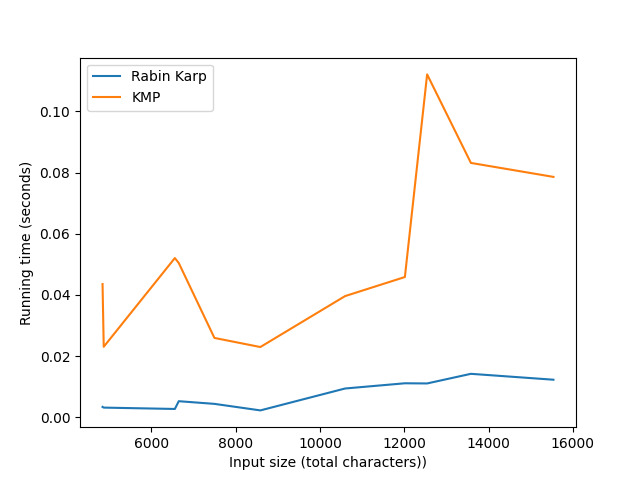

# COSC 320 - Algorithm Analysis Project

### Team and Contributions

Esteban Martinez (22717805)

-   `main.py` and `kmp.py`
-   `README.md`

Youssef Mahmoud (37624970)

-   `naive_lcss`
-   `dynamic_lcss`

Khalid Mahmoud (28842458)

-   `rabin_karp.py`

## Project Structure

This project focused on analysing the performance of three algorithms for string matching in the conext of detecting plagiarism:

-   Rabin-Karp
-   Knuth-Morris-Pratt (referred to as KMP)
-   Longest Common Substring (LCSS)

The project is broken down into four directories and one `main.py` file which is the entry point for the program.

-   `Algorithms` includes the four algorithms which are ran for analysis in their respective files. These are all wrapped in functions which are called in `main.py`.
-   `Data` includes two directories, `external-detection-corpus` and `test-corpus`.
    -   `external-detection-corpus` is a corpus of 500 source documents and 500 potentially plagiarised documents which compose the main testing set.
        -   **Source**: Potthast, Martin, Stein, Benno, Eiselt, Andreas, Barrón-Cedeño, Alberto, & Rosso, Paolo. (2011). PAN Plagiarism Corpus 2011 (PAN-PC-11) [Data set]. Zenodo. https://doi.org/10.5281/zenodo.3250095
    -   `test-corpus` is a corpus of 11 source and 11 suspicious documents. The 11 source documents were pulled from a variety of news and scholarly articles, and the suspicious documents were synthetically plagiarised using OpenAI's ChatGPT, as well as manual input.
-   `Plots` includes all the output plots from `main.py`.
-   `MilestoneReports` includes all the reports for our milestones.

## How it Works

`main.py` is a simple program for running the algorithms, and can be easily edited to run on different files by editing the `src_dataset` and `sus_dataset` file paths. The program defines the `testAlgorithm` function, and calls it to run the algorithms on the dataset.

## Problems Encountered

Due to the massive size of some of the files, the program can take an enormous amount of time to compute. For this reason, we decided to use a compute dedicated cloud computer using the Google Cloud Compute Engine API (AMD based, 8 core, 32 GB RAM) to do our large calculations.

This allowed us to produce graphs for the KMP and Rabin Karp algorithms with our large dataset, but we still ran into memory issues with our LCSS algorithms. This was because our LCSS implementations used a 2D array, as well as temporary storage for our files in the form of `src_processed` and `sus_processed`.

For this reason, we created another implementation, `optimized_lcss.py` which instead iterates the files line by line to check for longest common subsequences and does not create a processed version of the file. It also does not create a 2D array and instead uses 2 different arrays.

With this new file we were able to produce a graph using our large dataset.

## How to Run

1. Clone the repository
2. Use the command `pip install -r requirements.txt` to install the required packages
3. Run `import nltk` in a python shell and run `nltk.download("punkt")` to download the required nltk package for the KMP implementation
4. Run `python main.py` to run the program

## Results

### Large Dataset

Rabin Karp Algorithm with Large Dataset
.png>)

KMP Algorithm with Large Dataset
.png>)

Optimized LCSS Algorithm with Large Dataset
.png>)

### Small Dataset

Rabin Karp Algorithm with Small Dataset

KMP Algorithm with Small Dataset

Optimized LCSS Algorithm with Small Dataset

Dynamic LCSS Algorithm with Small Dataset

Naive LCSS Algorithm with Small Dataset

## Conclusion

Overall, the general trend in running times of the algorithms was (generally) as expected.

The Rabin Karp algorithm was by far the fastest, even though it has a time complexity of O(mn), it is generally expected to only make O(n+m) comparisons. Although not as visible in the smaller dataset, this algorithm did exhibit a linear time growth in the graph as would be expected.

The second fastest was the KMP algorithm, which has a time complexity of O(n+m). Their slight difference in time complexity could very well be down to implementation details, such as the fact that our KMP algorithm tests for all possible subsequences in the text, and uses natural language processing to process sentences in the text. Again, the shape of its growth was not as apparent in the small dataset, but was evidently linear in the large dataset.

The third fastest (which was much slower than the previous two) was the memory optimized version of LCSS. This algorithm behaved strangely, and did not have a very defined shape in the small dataset, and looked practically linear in the large dataset. We are not too sure about the usefulness of this particular algorithm in the analysis, and some of the optimizations we made might have significantly changed the way we anayles LCSS in previous milestones.

Finally, the dynamic LCSS was the next fastest, followed by the naive implementation. These algorithms have a complexity of O(mn^2), and demonstrated a markedly quadratic shape even on a small dataset. We believe that this quadratic growth, along with the extreme memory growth of our implementation, made it impossible to test this implementation on larger datasets. This is regretable, but we find this to be illustrative of the importance of the analysis of growth functions in the design of algorithms, as programs can quickly grow to be computationally unfeasable even for extremely capable modern systems given a large enough input (but not one which we wouldn't find in the real world).
